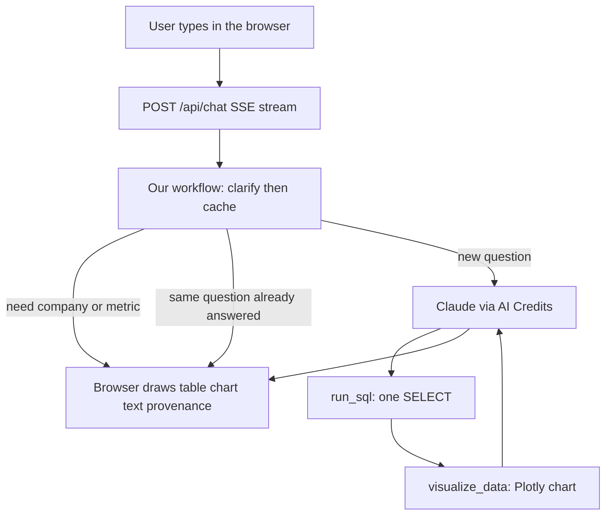

# StockJarvis codebase guide

A plain-language map of this chatbot so you can answer questions from a teammate without digging through every file.

If you remember only one sentence: **the user types English, we turn it into one safe SQL query against NSE filing numbers in Postgres, then show a table, a chart, and a short summary.** We never invent figures. If the filings cannot answer, the bot says exactly: `This information is not with us.`

---

## 1. What we built

**StockJarvis** is a filings-only chat product (Woodfrog). It answers questions such as:

- “Show SBI revenue”
- “Top 10 companies by revenue”

It does **not** browse the web, pull live market prices, or guess. The only source of numbers is the Postgres database `sj_bot_db`, which holds companies, processed NSE XML/XBRL filings, and the numeric facts inside those filings.

There is **no login**. Everyone is treated as the same local user.

The chat page is **ours** (`app/web/`). We do **not** use Vanna’s drop-in `<vanna-chat>` widget.

---

## 2. Vanna vs StockJarvis (the question people mix up)

**Vanna** is an open-source *engine* (vendored in the `vanna/` folder). Think of it as a ready-made loop:

1. Take a user message.
2. Give an LLM a list of **tools** (functions it can call).
3. Let the model call those tools (run SQL, draw a chart).
4. Stream UI pieces (table, chart, text) back to the browser.

Vanna does **not** know our filings schema, our safety rules, or our UI. That is all **our** code in `app/`.

| Piece | Who owns it |
| --- | --- |
| Agent loop (LLM ↔ tools ↔ stream) | Vanna (`vanna/src/vanna/core/agent/`) |
| FastAPI chat streaming helper | Vanna (`ChatHandler`) wrapped by us |
| Which LLM (Claude via AI Credits) | Us (`app/llm.py`) |
| Which SQL is allowed | Us (`app/sql_guard.py`) |
| How SQL is executed | Us (`app/sql.py`) on top of Vanna’s Postgres runner |
| How charts are drawn | Us (`app/charts.py`) |
| Ask for company / metric first | Us (`app/clarify.py`, `app/workflow.py`) |
| Cache answers | Us (`app/db_cache.py`) |
| The web page | Us (`app/web/`) |
| System prompt + schema | Us (`app/prompt.py`, `app/schema_knowledge.py`) |

**Analogy:** Vanna is the kitchen (stove, utensils, serving plates). StockJarvis is the recipe, the ingredients (filings DB), the food-safety rules (SQL allow-list), and the restaurant dining room (our UI).

We copied Vanna into this repo (`vanna/`) so Render and local installs use the same version. We did not rewrite Vanna’s core loop.

---

## 3. What happens when someone asks a question



**Step by step**

1. **Browser** (`app/web/app.js`) sends the text to `POST /api/chat`. The server replies as **SSE** (a live stream of small JSON chunks), not one big JSON blob. That is why the spinner stays until the stream ends.

2. **Vanna Agent** (`create_agent` in `app/agent.py`) receives the message. Before it talks to Claude, it runs **our workflow** (`app/workflow.py`).

3. **Clarify (optional).** If the question is like “show revenue” and no company is known, we **do not** run SQL. We ask: which company? Ranking questions (“top 10 companies by revenue”) do **not** need a company. Follow-ups remember the last company/metric/period in `conversations/{id}/state.json`.

4. **Cache (optional).** If we have already answered this exact question (after normalizing spaces/case) **and** the filings database has not grown, we replay the saved table + chart + summary. No Claude, no SQL.

5. **Claude + tools.** If we must compute a new answer:
   - Claude is told the schema and the rules (one `SELECT`, only certain tables, never invent numbers).
   - It must call **`run_sql` at most once**, then **`visualize_data`**, then write a short summary.
   - Maximum **3** tool rounds (`MAX_TOOL_ITERATIONS = 3`): SQL + chart + stop.

6. **SQL safety.** Before Postgres sees the query, `app/sql_guard.py` checks:
   - Only `SELECT` or `WITH` (no INSERT/UPDATE/DELETE).
   - Only analytical tables: `companies`, `filings`, `financial_facts`, `tag_catalog`, `metric_tag_mappings`, `xbrl_contexts`, `derived_metric_definitions`.
   - The LLM is **not** allowed to read `query_log` or `report_cache` (those are our cache/audit tables; only app code writes them).
   - Statement timeout **15 seconds**, **500** row cap.

7. **Chart.** `app/charts.py` picks a sensible chart: ranked companies → horizontal bar (`hbar`); one company over time → line; a distribution → histogram.

8. **Provenance.** After SQL, we attach “How these numbers were produced” (tags, metric, SQL preview). Built from the **actual query and rows**, not from Claude making something up.

9. **Save.** On success, we write `query_log` (the question) and `report_cache.rendered_report` (the full response) so the next identical ask is fast.

---

## 4. The database (what “filings” means)

NSE filings arrive as XML/XBRL. Another pipeline (not this chatbot) parses them into Postgres. We only **read** that data.

In everyday language:

- **`companies`** — name and ticker (`SBIN`, `INFY`, …).
- **`filings`** — one report for a company and a period (quarter / year). We only use rows with `processing_status = 'Processed'`. Amounts are scaled by `rounding_level` (Lakhs, Crores, …).
- **`tag_catalog`** — XBRL tag names (`qname`), e.g. `in-bse-fin:RevenueFromOperations`.
- **`metric_tag_mappings`** — maps a business word like `revenue` to approved tags. The LLM should filter `status = 'APPROVED'`.
- **`financial_facts`** — the actual numbers (`value_numeric`).
- **`xbrl_contexts`** — extra period/entity context; used only when needed.
- **`derived_metric_definitions`** — formulas for things like growth (if present).
- **`query_log`** — every question we handled (audit). App writes; LLM cannot SELECT.
- **`report_cache`** — saved answers in `rendered_report`. App writes; LLM cannot SELECT.

Typical join (also in the system prompt):

`companies → filings (Processed) → financial_facts → tag_catalog → metric_tag_mappings (APPROVED)`

---

## 5. Folder map

```
app/                 StockJarvis product (what we wrote)
app/web/             The chat page (HTML, CSS, JS + Plotly)
vanna/               Vendored Vanna 2 engine (kitchen)
tests/               Pytest — prove clarify, SQL guard, cache, charts, …
scripts/             One-shot: migrate old file cache into Postgres
docs/                This guide + Render deploy notes
```

### Our Python files (`app/`)

| File | What it does, in one line |
| --- | --- |
| `main.py` | Loads `.env`, builds the agent, starts the web server (`0.0.0.0:$PORT`). |
| `server.py` | FastAPI routes: `/`, `/api/chat`, catalog APIs, `/health`. Adds the provenance SSE chunk. |
| `agent.py` | **Wires everything together**: Claude, SQL tool, chart tool, workflow, cache hook, no-login user. |
| `llm.py` | Talks to Claude through AI Credits (OpenAI-compatible URL). **Non-streaming** tool calls, **90s** timeout so the UI does not hang. |
| `config.py` | Reads `DATABASE_URL` / `PG*` and API keys. Fixes Render’s `postgres://` URLs and SSL. |
| `users.py` | No login: always user `local` / `stockjarvis`. |
| `prompt.py` | The instructions Claude sees (filings-only, one SQL, chart rules). |
| `schema_knowledge.py` | Static table descriptions for the prompt (structure only, no live numbers). |
| `workflow.py` | Gate before Claude: clarify if slots missing, else cache, else let Claude run. |
| `clarify.py` | Detects company / metric / period; LLM JSON first, regex fallback. Ranking skips company. |
| `conversation.py` | Saves slots per thread in `conversations/{id}/state.json`. |
| `sql.py` | Runs the SELECT on Postgres; stashes SQL + rows for cache and provenance. |
| `sql_guard.py` | Allow-list: SELECT/WITH + analytical tables only. Fallback sentence lives here. |
| `charts.py` | Plotly charts; ranking uses `hbar` (`x=value_numeric`, `y=company_name`). |
| `catalog.py` | Sidebar APIs: company list, tag list, coverage counts. |
| `cache.py` | File cache used in **tests**; also the in-memory “pending SQL” stash during a turn. |
| `db_cache.py` | Production cache: upsert `report_cache`, insert `query_log`. |
| `fingerprint.py` | Cheap DB fingerprint so cache is skipped after new filings are loaded. |
| `provenance.py` | Builds “how these numbers were produced” from SQL + rows. |
| `hooks.py` | After a successful turn, write the cache; inject remembered slots into the prompt. |
| `example.py` | CLI one-shot question (no browser). |

### What Vanna is doing inside `vanna/`

You rarely need to edit this. Useful mental model:

- **`Agent.send_message`** — the main loop: workflow → LLM → tool calls → stream UI components.
- **`ToolRegistry`** — the catalog of tools Claude may call. We register only `run_sql` and `visualize_data`.
- **`ChatHandler`** — turns those components into SSE chunks for FastAPI.
- **`FileSystemConversationStore`** — saves chat history under `./conversations/`.
- **`OpenAILlmService`** — we subclass this; AI Credits looks like OpenAI’s API.

If a teammate asks “is this a Vanna demo app?” the accurate answer is: **we use Vanna as the agent runtime; the product, data, safety, cache, and UI are StockJarvis.**

---

## 6. The UI

Files: `app/web/index.html`, `styles.css`, `app.js`.

- Left **catalog rail**: company count, filing coverage, searchable companies, searchable XBRL **tag names** (`qname` only on the chip).
- Center: conversation. User bubbles vs bot (table, Plotly chart, markdown, provenance `<details>`).
- Composer at the bottom. Clicking a company or tag drops that text into the box.

Chat API: `POST /api/chat` (alias `/api/vanna/v2/chat_sse` so old Vanna paths still work). Catalog: `/api/catalog/summary|companies|tags`. Health: `/health`.

---

## 7. Rules that often come up in review

**“Why didn’t it just query?”**  
`show revenue` is incomplete. We ask for a company. `top 10 companies by revenue` is a ranking, so we do not ask for a company.

**“Why did it say This information is not with us.?”**  
No rows, blocked SQL, or Claude decided the filings cannot answer. That exact sentence is required. We do not estimate.

**“Why did I get an old table after loading more filings?”**  
We cache by question text. Cache also stores a **data version** (counts of companies, processed filings, facts, max period). If those change, the cache is skipped. If a bulk import is still running, cache will keep missing — that is intentional.

**“Can Claude delete data?”**  
No. Only SELECT/WITH on the allow-list. Writes to `query_log` / `report_cache` are our app code with parameterized SQL.

**“Which model?”**  
Claude via **AI Credits** (`AICREDITS_*` env), not a local model and not CoreThink. Default model name is in `.env.example`.

**“Do we train Vanna on SQL examples?”**  
No. We do not use Vanna’s training-memory path for this product. The schema is a **static prompt** plus tools. `DemoAgentMemory` is a stub.

**“Where is login?”**  
Removed on purpose (`NoAuthUserResolver`).

---

## 8. How to run it (so you can demo)

```bash
cd /Users/samruddhimore/Desktop/t-to-sql
source .venv/bin/activate
PYTHONPATH=. python -m app.main
```

Open http://127.0.0.1:8000. Secrets stay in `.env` (never commit it). Uvicorn here does **not** auto-reload — restart after code changes.

Tests: `PYTHONPATH=. python -m pytest tests/ -q`

Deploy notes (Render, dump/restore): [docs/render.md](render.md).

---

## 9. Quick answers for a teammate

- **Product:** StockJarvis — chat over NSE filings in Postgres.
- **Engine:** Vanna 2 agent loop (tools + SSE).
- **Brain:** Claude through AI Credits.
- **Truth:** `sj_bot_db` financial facts only.
- **Safety:** SELECT allow-list, 15s timeout, 500 rows, no cache tables for the LLM.
- **UX:** Our page, Plotly charts, provenance dropdown, catalog sidebar.
- **Speed:** Postgres `report_cache` keyed by normalized question + data fingerprint.
- **Honesty:** If filings cannot answer → `This information is not with us.`
